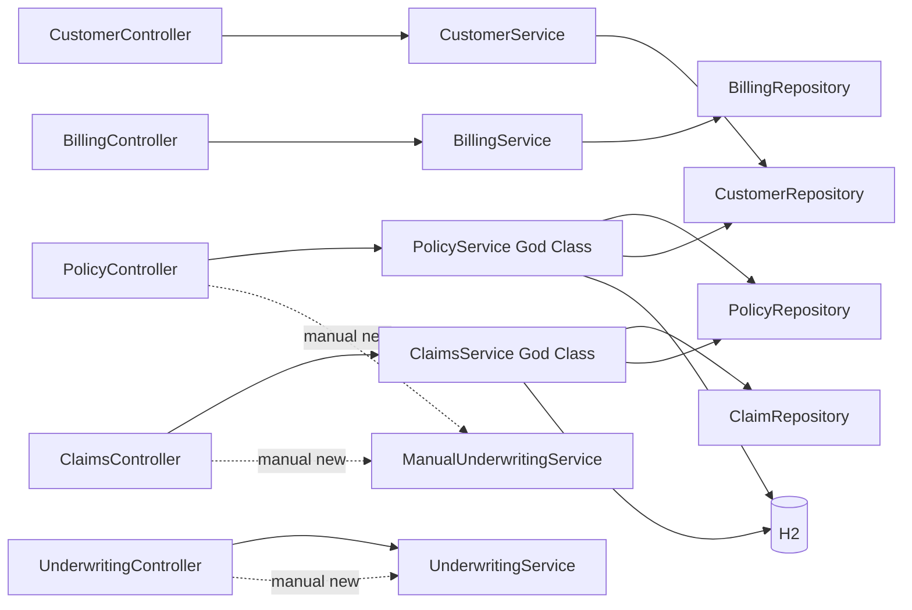

# Architecture and Technical Debt Assessment

## Current Architecture (Intentionally Legacy)

## Debt Inventory
1. God classes: `PolicyService` and `ClaimsService` contain orchestration, calculations, SQL, and persistence.
2. Duplicated logic in multiple premium/threshold methods.
3. Tight coupling from controller-level object creation.
4. Raw SQL in service layer via `JdbcTemplate`.
5. Generic and swallowed exception handling.
6. Hardcoded strings and magic numbers for business rules.
7. Inconsistent naming conventions reducing readability.
8. Entities exposed directly through APIs.
9. Validation spread across ad hoc checks.

## Why This Is Useful For Demos
- Problems are realistic and recognizable in enterprise systems.
- Refactoring opportunities are visible and incremental.
- Behavior can be protected by baseline tests while improving design.
